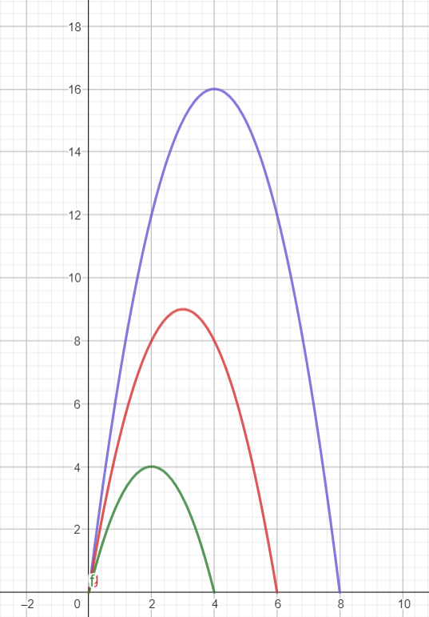

# Day 6 | Part 1
>[!NOTE] Number of ways to beat the recored will be called solution count for short

## Approach
- For each line array of numbers is created containing all numbers for that line
- For each set of values (corresponding values from first and second lines) solution count is calculated using [Quadratic equation](#quadratic-equation)
- Multiply solution by calculated number (initially set to one) and output the solution 

## Quadratic equation
How to get the equation:

>[!NOTE]
>Following values will be present in the explanation:
> $t$ = time value, $r$ = record
>
> Also X value on the grid will be called argument and Y value will be called value

First, let's look at graph with time-to-distance graph for $t$ equal to 4, 6 and 8:

🟢 -> time = 4 | 🔴 -> time = 6 | 🔵 -> time = 8

We can notice that argument (X axis) range for each diagram are numbers larger than 0 and smaller than $t$. Also values of outlying arguments have values (Y axis) equal to 0. With this information we can use quadratic equation in following form:

$y = a(x-x_1)(x-x_2) = a(x-0)(x-t)$

where $x_1$ is first X axis intercept argument and $x_2$ is second X axis interception argument

As we can see, $x_1$ is always equal to 0 and $x_2$ is equal to $t$, only unknown value is $a$. It is possible to calculate $a$ using any point on diagram like this:

$a = \frac{y}{(x-x_1)(x-x_2)}$

We will calculate this value from all three diagrams to make sure $a$ doesn't depend on $t$:

$a = \frac{3}{(1-0)(1-4)} = \frac{3}{-3}=-1$

$a = \frac{8}{(2-0)(2-6)} = \frac{8}{-8}=-1$

$a = \frac{12}{(2-0)(2-8)} = \frac{12}{-12}=-1$

We confirmed that $a$ doesn't depend on $t$ and is equal to -1. This is how the quadratic exuation looks like now:

$y = a(x-x_1)(x-x_2) = -1(x-0)*(x-x_2) = -x^2+xt$

If we compare this with following equation we can find $a$, $b$ and $c$ values:

$y = ax^2 + bx + c$

$a = -1$

$b = t$

$c = 0$

Now we have all values we need for quadratic equation, so we need to find a way to calculate lowest and largest amount of time that lets us beat the record (will be larger than $r$).

There are following three equations that let us calculate X axis interception arguments:

$x_1 = \frac{-b+\sqrt{\Delta}}{2a}$

$x_2 = \frac{-b-\sqrt{\Delta}}{2a}$

$\Delta = b^2 - 4ac$

If we know that, we could calculate lowest and highest amount of time that lets us beat the record, but only if $r$ is equal to 0. But we can move down entire quadratic function by $r$, so X axis interception values will be equal to values we need . We can do it like that:

$y = -x^2 + xt - r$

Now we have everything we need to calculate our values, also note that $c$ value changed to $-r$.

$\Delta = b^2 - 4ac = t^2 - 4r$

$x_1 = \frac{-b+\sqrt{\Delta}}{2a} = -\frac{-t+\sqrt{t^2-4r}}{2}$

$x_2 = \frac{-b-\sqrt{\Delta}}{2a} = -\frac{-t-\sqrt{t^2-4r}}{2}$

With these two equations we can calculate the actual solution to the puzzle ($s$). Firstly we calculate $x_1$ and $x_2$, and assign them as $s_s$ (***solution start***) and $s_e$ (***solution end***). Then we make sure that $s_s \neq x_1$ and $s_e \neq x_2$, because if these values were equal, the record wouldn't be beaten, but only matched. We can achieve it by rounding $s_s$ up an rounding $s_e$ down. In case $s_s$ was already an integer we should add 1 to it and if $s_e$ was already an integer we should subtract 1 from it.

After that we calculate the actual solution by subtracting $s_s$ from $s_e$ and adding 1:

$s = s_e - s_s + 1$

And here we have the solution to the puzzle.
As a bonus, there is geogebra calculator for todays puzzle in day 6 folder. Set $t$ and $r$, then read solution in $s$. Geogebra calculator is working exactly like desribed in this explanation.